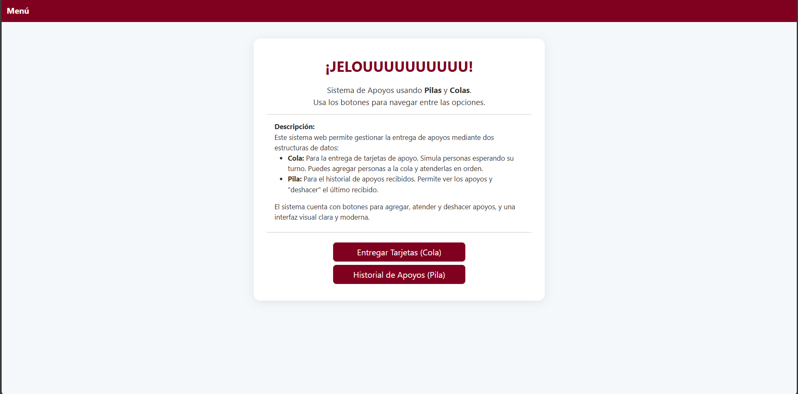
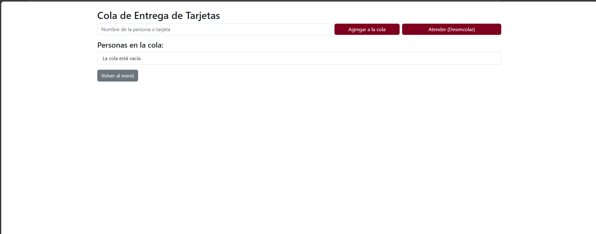
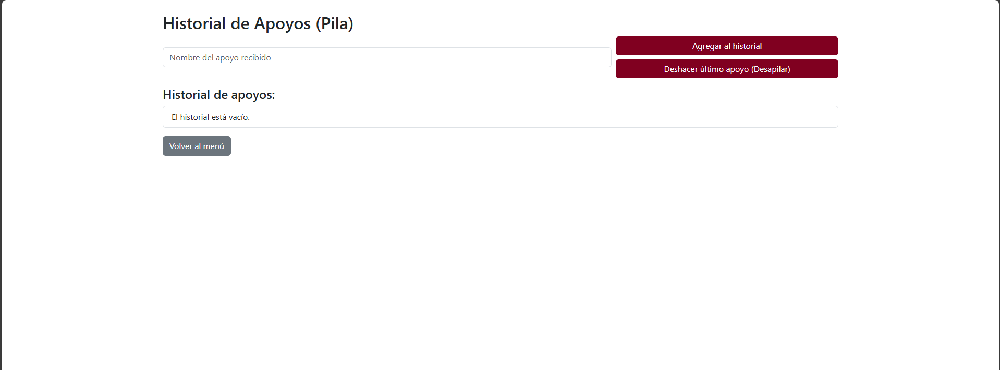

# Sistema de Apoyos (Pilas y Colas)

**Nombre:** Victor Daniel Gonzalez Flores   
**Grupo y materia:** 1 - Estructura de Datos

## Descripción
Sistema web sencillo en Python usando Flask para gestionar:
- **Cola:** Entrega de tarjetas de apoyo (personas esperando su tarjeta).
- **Pila:** Historial de apoyos recibidos (simula deshacer apoyos).

## Estructura del proyecto
```
menuflask/
├── app.py
├── README.md
├── models/
│   ├── pila.py
│   └── cola.py
├── templates/
│   ├── menu.html
│   ├── cola.html
│   └── pila.html
```

## Instrucciones para instalar dependencias y ejecutar
1. Instala Flask:
   ```bash
   pip install flask
   ```
2. Ejecuta la aplicación:
   ```bash
   python app.py
   ```

### Paso 1: Menú General

Desde el menú principal puedes elegir entre gestionar la **Cola** o el **Historial de Apoyos (Pila)**.

### Paso 2: Cola de Tarjetas

En la sección de **Cola** puedes agregar personas y atenderlas en orden de llegada.

### Paso 3: Historial de Apoyos (Pila)

En la sección de **Pila** puedes agregar apoyos recibidos y deshacer el último si es necesario.

---

